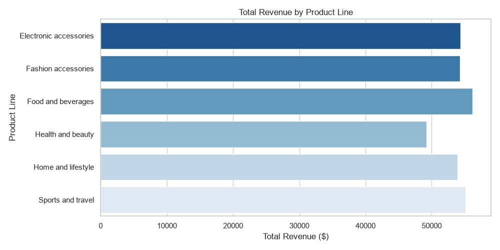
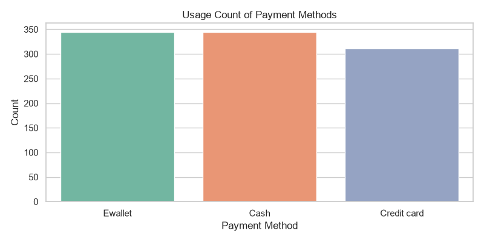

# 🛒 Sales Analytics Dashboard — Supermarket Sales Analysis

A complete end-to-end data analysis project exploring supermarket sales performance, customer behavior, and product revenue trends using **Python (Pandas)** and **SQL (SQLite)**.

---

## 📌 Project Overview
This project analyzes retail sales data to uncover key business insights, such as high-performing product lines, customer preferences between Members vs. Regular shoppers, and popular payment methods.

---

## 🛠️ Tech Stack
* **Language:** Python 3.x
* **Data Manipulation & Analysis:** Pandas, NumPy
* **Data Visualization:** Matplotlib, Seaborn
* **Database & Querying:** SQLite & SQL

---

## 📊 Key Business Insights (Found from Analysis)
1. **Top Revenue Driver:** Product lines like *Food and beverages* and *Sports and travel* bring in the highest overall revenue.
2. **Customer Type:** Members and normal customers show nearly identical spending averages, meaning loyalty programs can be optimized further.
3. **Payment Preferences:** E-wallets and Cash are neck-and-neck as the most popular payment methods.

---

## 📈 Visualizations



---

## 🚀 How to Run Locally

1. **Clone the repository:**
   ```bash
   git clone [https://github.com/YOUR-USERNAME/supermarket-sales-dashboard.git](https://github.com/YOUR-USERNAME/supermarket-sales-dashboard.git)
   cd supermarket-sales-dashboard